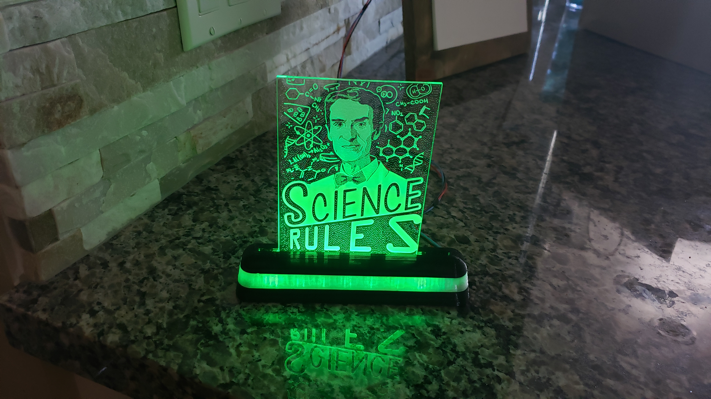
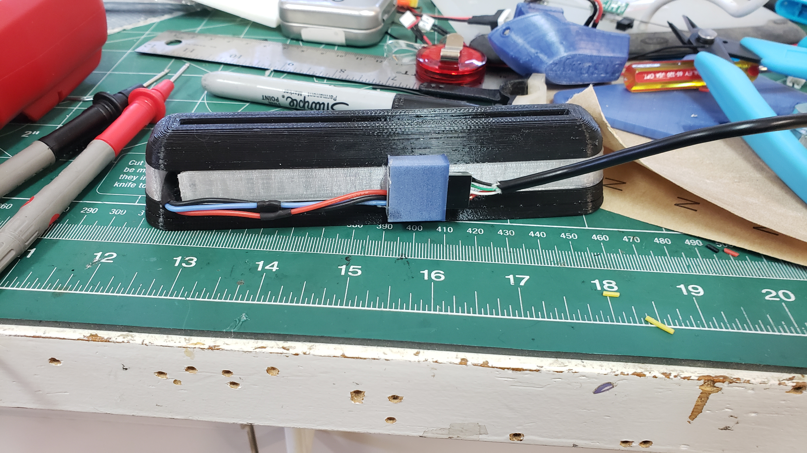

# AcrylicEtching_LEDStand
LED emitting base for lighting up etched acrylic panes,
Fusion 360 CAD file dynamic link: 

3 piece 3D printed etched acrylic LED stand.
For 3mm thick panes, 125mm wide, any height but it only lights it up well to about 200mm. (I have another repo for a full LED frame that fixes that).
Works with most LED ws2812 led strips

## Project Pictures

Final

This is the rear of it where I stored the brains for the stand to d the light functions.

